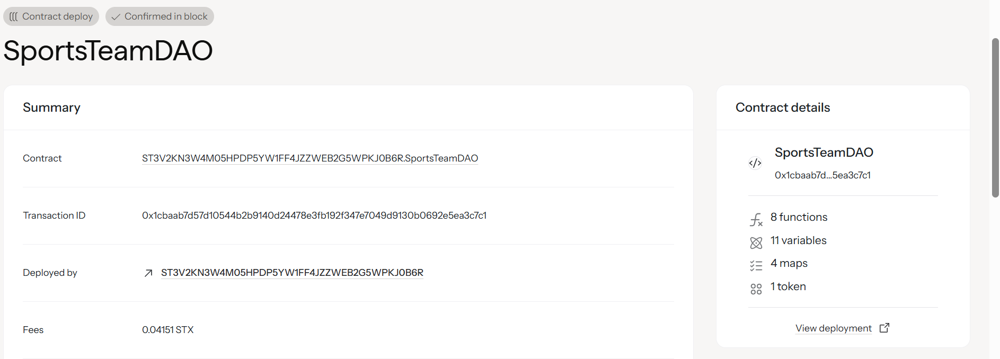

# SportsTeam DAO

## 📋 Project Description

SportsTeam DAO is a revolutionary blockchain-based governance system that enables fans to collectively own and manage their favorite sports teams. Built on the Stacks blockchain using Clarity smart contracts, this platform transforms traditional sports team ownership by democratizing decision-making through token-based voting rights and transparent revenue sharing mechanisms.

The platform allows fans to purchase membership shares, which grant them both governance tokens for voting on team decisions and entitlement to a proportional share of team revenues. This creates a truly fan-owned sports ecosystem where supporters become stakeholders with real financial and operational influence.

## 🛠️ Tech Stack Used

- **Blockchain**: Stacks (Bitcoin Layer 2)
- **Smart Contract Language**: Clarity 3.0
- **Token Standard**: SIP-010 Fungible Token
- **Development Environment**: Stacks Explorer Sandbox
- **Network**: Stacks Testnet
- **Frontend**: HTML/CSS/JavaScript (optional)
- **Wallet Integration**: Stacks Wallet (Hiro/Xverse)

## ⚙️ Setup Instructions

### Prerequisites
1. **Stacks Wallet**: Install [Hiro Wallet](https://wallet.hiro.so/) or [Xverse](https://xverse.app/)
2. **Testnet STX**: Get free testnet tokens from [Stacks Faucet](https://explorer.hiro.so/sandbox/faucet?chain=testnet)
3. **Web Browser**: Chrome, Firefox, or Safari with wallet extension

### Local Development Setup
```bash
# Clone the repository
git clone https://github.com/yourusername/sportsteam-dao.git
cd sportsteam-dao

# Install Clarinet (optional - for local testing)
npm install -g @hirosystems/clarinet-cli

# Initialize Clarinet project (if developing locally)
clarinet new sportsteam-dao
```

### Contract Interaction Setup
1. **Connect Wallet**: Connect your Stacks wallet to testnet
2. **Get Test STX**: Visit the faucet and get testnet STX tokens
3. **Contract Address**: Use `ST3V2KN3W4M05HPDP5YW1FF4JZZWEB2G5WPKJ0B6R.SportsTeam-DAO`
4. **Stacks Explorer**: Visit [Stacks Explorer](https://explorer.hiro.so/?chain=testnet) to interact

## 📍 Smart Contract Address

**Testnet (Active):** `ST3V2KN3W4M05HPDP5YW1FF4JZZWEB2G5WPKJ0B6R.SportsTeam-DAO`
**Mainnet:** [Coming Soon]

**Deployment Details:**
- Transaction: `0x724668dd096ab6e64b473ae19eb3d14b53ef1bd37fd76fc7ea6/cc6692e0ed178`
- Block Height: #3527687
- Status: ✅ Confirmed and Verified

## 🚀 How to Use the Project

### For Fans (DAO Members)

#### Step 1: Purchase Membership
```javascript
// Call purchase-membership function
// Example: Buy 5 shares for 5 STX
contract.call('purchase-membership', [5])
```

#### Step 2: Check Your Stats
```javascript
// Get your shares
contract.call('get-member-shares', [your-address])

// Get your voting power
contract.call('get-member-voting-power', [your-address])

// Check claimable revenue
contract.call('get-claimable-amount', [your-address])
```

#### Step 3: Claim Revenue
```javascript
// Claim your share of team revenue
contract.call('claim-revenue-share', [])
```

### For Team Management

#### Add Revenue to DAO
```javascript
// Add team earnings (ticket sales, sponsorships, etc.)
contract.call('add-team-revenue', [amount-in-microstx])
```

### Using Stacks Explorer
1. Go to [Stacks Explorer](https://explorer.hiro.so/?chain=testnet)
2. Search for contract: `ST3V2KN3W4M05HPDP5YW1FF4JZZWEB2G5WPKJ0B6R.SportsTeam-DAO`
3. Connect your wallet
4. Call functions directly in the explorer

### Example Transactions
- **Buy 10 shares**: Call `purchase-membership` with `u10`
- **Check balance**: Call `get-member-shares` with your address
- **Claim rewards**: Call `claim-revenue-share` with no parameters

## 👥 Team Members

**Project Lead & Smart Contract Developer:** Mohit Sharma
- GitHub: @mohitsharma1305
          https://github.com/mohitsharma1305/
- Role: Clarity smart contract development, architecture design

**Additional Contributors:**
- [Add team member names and roles if working in a group]

## 📁 Repository Structure

```
sportsteam-dao/
├── contracts/
│   └── contract.clar          # Main smart contract
├── frontend/                  # Web interface (optional)
│   ├── index.html
│   ├── style.css
│   └── script.js
├── README.md                  # This file
├── contract-address.txt       # Deployment details
└── LICENSE                    # MIT License
```

Our vision is to revolutionize sports team ownership by creating a decentralized, transparent, and inclusive model where passionate fans become true stakeholders in their team's success. We aim to:

- **Democratize Sports Ownership**: Make team ownership accessible to every fan, regardless of financial status
- **Enhance Fan Engagement**: Transform passive spectators into active participants in team governance
- **Ensure Transparency**: Provide complete visibility into team finances and decision-making processes
- **Create Sustainable Revenue Models**: Establish fair revenue distribution that rewards loyal fan investment
- **Pioneer Sports Innovation**: Set new standards for how sports organizations can operate in the digital age

Through blockchain technology, we're building a future where every fan can have a voice in their team's direction and share in both the challenges and rewards of sports ownership.

## 🔮 Future Scope

### Phase 1: Core Functionality (Current)
- ✅ Membership share purchasing system
- ✅ Revenue sharing mechanism
- ✅ Basic governance token distribution

### Phase 2: Advanced Governance (Q2 2025)
- 🔄 Proposal creation and voting system
- 🔄 Multi-signature treasury management
- 🔄 Delegation and proxy voting mechanisms
- 🔄 Time-locked governance decisions

### Phase 3: Enhanced Features (Q3-Q4 2025)
- 📋 Player trading vote mechanisms
- 📋 Stadium and facility investment decisions  
- 📋 Coaching staff hiring/firing votes
- 📋 Marketing and sponsorship approval system
- 📋 Season ticket allocation based on shares

### Phase 4: Ecosystem Expansion (2026)
- 📋 Multi-team DAO federation
- 📋 Cross-team trading and partnerships
- 📋 NFT integration for special voting rights
- 📋 Mobile app for seamless fan interaction
- 📋 Integration with existing sports leagues

### Phase 5: Advanced Analytics (2026+)
- 📋 AI-powered team performance prediction
- 📋 Fan sentiment analysis for decision making
- 📋 Dynamic pricing for membership shares
- 📋 Automated revenue distribution optimization
- 📋 Integration with sports betting platforms (where legal)

### Long-term Vision
- Global expansion to multiple sports leagues
- Partnership with traditional sports organizations
- Development of DAO governance standards for sports
- Creation of a decentralized sports management ecosystem

## Key Features

### Current Implementation

**Membership System:**
- Purchase shares using STX tokens
- Automatic governance token minting
- Transparent ownership tracking

**Revenue Sharing:**
- Proportional revenue distribution
- Claimable earnings based on ownership percentage
- Real-time balance tracking

**Governance Foundation:**
- Voting power proportional to token holdings
- Transparent member verification
- Decentralized ownership structure

## Technical Specifications

- **Blockchain**: Stacks (Bitcoin Layer 2)
- **Smart Contract Language**: Clarity
- **Token Standard**: Fungible Token (SIP-010 compatible)
- **Governance Model**: Token-weighted voting
- **Revenue Currency**: STX (Stacks tokens)

## Contract Address Details

Contract ID : ST3V2KN3W4M05HPDP5YW1FF4JZZWEB2G5WPKJ0B6R.SportsTeamDAO


## Getting Started

### For Fans (Team Members)
1. Connect your Stacks wallet
2. Purchase membership shares using STX
3. Receive governance tokens automatically
4. Participate in team decisions through voting
5. Claim your share of team revenues

### For Team Management
1. Deploy the contract with initial parameters
2. Add team revenue through the designated function
3. Monitor fan engagement and governance participation
4. Execute approved governance decisions

## Security Features

- **Owner-only functions** for critical operations
- **Balance verification** before all transfers
- **Overflow protection** in mathematical operations
- **Access control** for sensitive functions
- **Transparent audit trail** for all transactions

---

*Built with ❤️ by the SportsTeam DAO community*

**License**: MIT  
**Version**: 1.0.0  
**Last Updated**: August 2025

